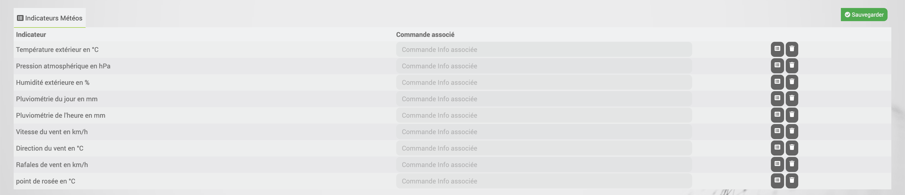

# Descripción

.
.

 :

>- <a href="http://www.wunderground.com">http://www.wunderground.com</a>
>- <a href="http://www.awekas.at">http://www.awekas.at</a>
>- <a href="http://ma.station-meteo.com">http://ma.station-meteo.com</a>

# Configuración

.

 :

.

>- <a href="http://www.wunderground.com">www.wunderground.com</a>
>- <a href="http://ma.station-meteo.com">ma.station-meteo.com</a>
>- <a href="http://www.awekas.at">www.awekas.at</a>

## 
Il faut aller <a href="http://www.awekas.at/fr/benutzer.php?mode=new">http://www.awekas.at/fr/benutzer.php?>

>- 
>- .
>- 

## 
Il faut aller <a href="https://www.wunderground.com/personal-weather-station/mypw">https://www.wunderground.com/personal-weather-station/mypw</a>

>- "
>- .
>- 

## 
Il faut aller <a href="http://ma.station-meteo.com/register/">http://ma.station-meteo.com/register/</a>
.  :

>- .
>- 
>- 

# Preguntas frecuentes

-  ?
>. .
>..

-  ?
>.
